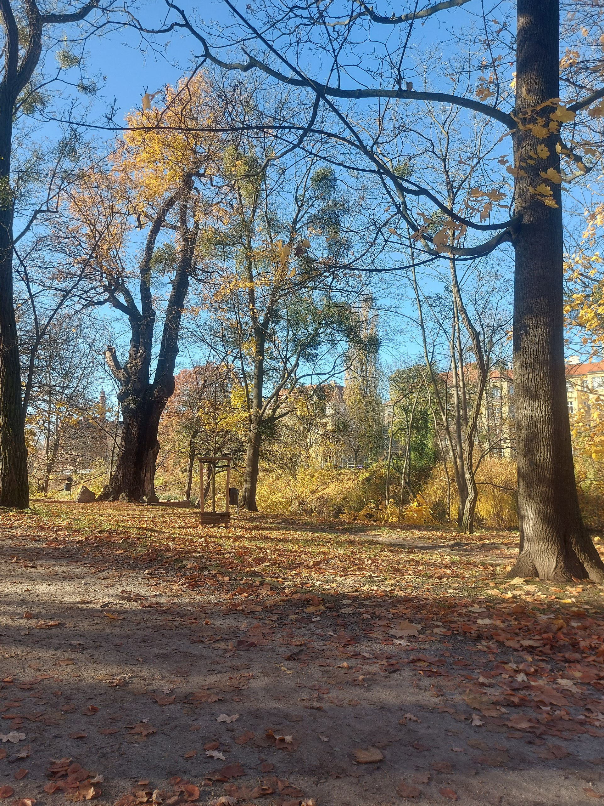

# Breath

***

<figure><figcaption></figcaption></figure>


Before my pilgrimage of soul to croatia
\
one of my very last trips was with my friend around the park where such a myriad of stuff that is really considerable in my life - breaking up, youth, dark nights,wolves
\
having said that, this memory is really important to me - the one I am going to speak of
\
once upon a time, me and my friend decided to walk around forementioned forest
\
we decided to take some really unhinged routes where we used to go, because nobody really is going via them, mayhap, that's why we chose the trail
\
anyway, the way itself is known for the ability(if you walk far enough) to climb the fence into yet another park, to which entrance is paid which we did, but that's not the main story
\
that day was really rainy
\
so we decided to not risk our whole budget consisting of ten hryvnias and mine antiseptic
\
we went via some really, really far path
\
and then we decided to get down

***
