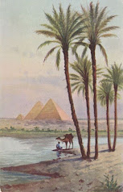

# Camel

***

<figure><figcaption></figcaption></figure>

Oh, dearness beloved\
Where have you been the days\
When I travelled upon the slaves\
Witnessing the rise and fall\
Everlasting process of the dawn\
Dawn, the end and beginning of you and I\
May never i open the eye\
The eye which leads dunes to I\
Camels passing by my eye\
Camel! My dear friend!\
Dunes are behind us\
Dunes hunting us to rise\
To rise, against the odds of wrath!\
In spite of all the vice\
Despite of being all and nothing\
Balance and equity return shall must\
My eyes will open,my hands will reocer\
You and I shall feel the strength\
Not known by the hands\
Not known by the lads\
Desired and loved by the friends\
The mighty Arthur's sword of justice\
Shall rule upon the world\
Oh, Camel!\
See the brightness in the gloomy night?\
That's the Messiah comming for you and I\
Moses is he called\
Shall he lead us to redemption\
Of you and I

***

