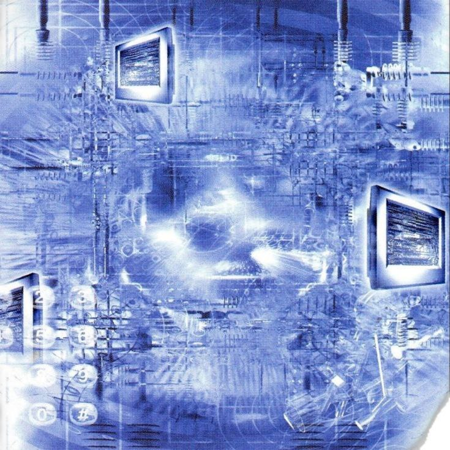

# Cyberia

***

<figure><figcaption></figcaption></figure>

The little piece of life's piece\
Slowlg passing, like a flow\
A feather's flow - gentle yet provoking\
An action to take - the deed shall be done\
The deed of freeing oneself from\
The tombstone of pain\
Oh, the chains of Dante's hell\
Will I manage to surmount?\
The one call out my name\
Asking whether I defined\
What I am,who I am\
Did I manage to sublime?\
To the purest feeling of mine\
Honestly and clarity - the monks know\
The price paid for finding the truth\
Exchanging yourself for the goods\
Awful! What to do?\
To cry oneself away before eyes close\
While soul breaks apart the chains\
Imprisoned you are, such a fool\
Your soul was the price\
Now Mind is the pain

***
