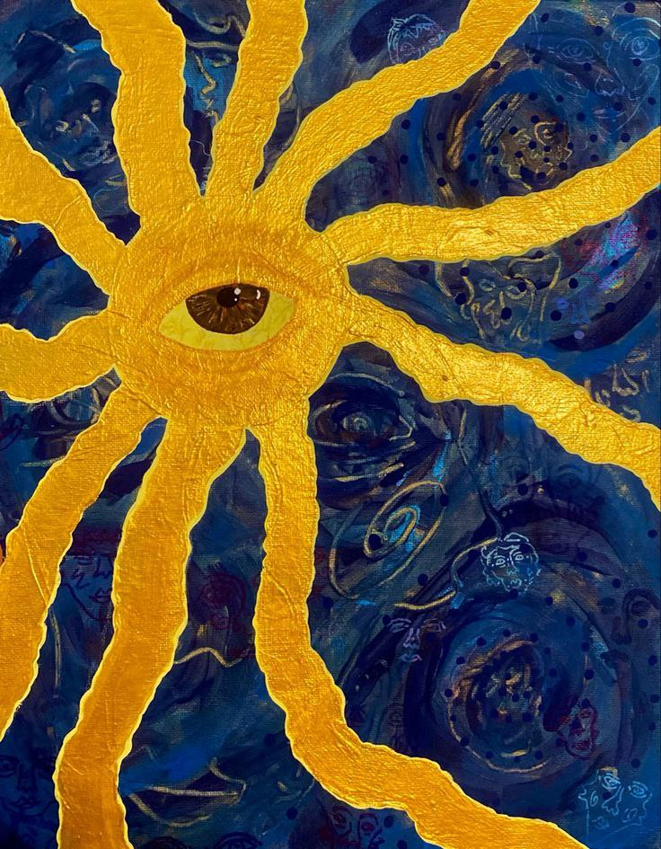

# Entrancing

***

<figure><figcaption></figcaption></figure>


Tender voice of the sea
\
Sail you shall, prevail you must
\
No journey is easy, yet a travel is needed
\
To find the concious self, mandatory one
\
Rudimentary might become abstract
\
Walking from left to right
\
A boat of mine is afraid of a flight
\
May be I blessed upon the journey of 10 years
\
For home returning I shall come
\
For my dog I might fall, Odysseus will recall
\
Oh, my beloved ones!
\
I am getting into vortex
\
Of my nightmares and dreams
\
What is real - what is not
\
The only point to unveil

***
