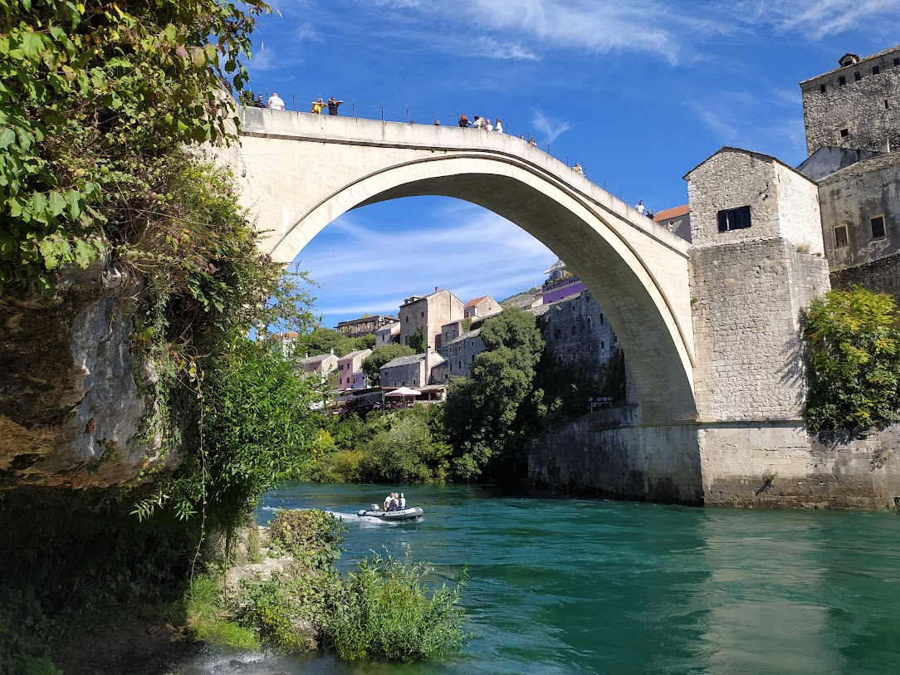

# Halfwaken

***

<figure><figcaption></figcaption></figure>

Having a thought upon thought
\
Be it dreams or the fears
\
My eyes broom left to right and right to left
\
In a hypnotic, halfwaken way
\
Smells of sand and dusty air
\
And air,such a blessing
\
It makes me fall asleep as soon as I lie
\
Entrancing me, into the dreamy sleepy
\
For away, from the worries of life
\
But a doctor it is not for a life
\
A doctor it is for the flight
\
A flight, which is the dream
\
Which I will see in the night
\
'Till awaken by the light
\
I will prevail in the dreamy sea
\
Sailing to the ocean
\
Which is called life

***
