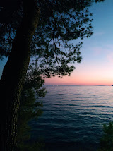

# MY MASTERS, AWAKEN!

<figure><figcaption></figcaption></figure>

***

My masters, Awaken!\
Gloriousness and biterness\
Bittersweetness of the kind\
The human kind\
The virtues were amongst my heart\
Longing for the time\
Oh, dear, they are coming back\
Within my soul, within my heart\
The flag is waving in the sky\
Amongst anothers, it shall fly\
Books and candles, vessels and wine?\
Some vines on verge of the shelf\
Some portraits of the Gray\
In a mosty cloudy day\
Forests' whisper may stay silent\
Violent days are screaming now\
Shall the do be done ,shall the soul be freed\
For witnesses were his own eyes!\
And whined the chain of chimneys\
"Dear Lord, the days are blind"

...\
My masters, shall truth be upon us\
Virtues, like rivers in the Alps\
Cold, pristine and fine\
For the do the dogmas may fly\
Crusaders within our hearts\
The reinado de educiones will obey\
The virtues given to us by the Skies\
The people will unite into one

Monolith formed for will be\
The truth will return, the only rule\
For peace upon the human kind\
No masters will be needed then\
May they rest in the shiny miriads of sky\
While people of the land\
Will cry in happiness of the newest time\
The news is heard around the globe\
For flies it as if a sound\
A hymn, a hymn for the free\
To do,to craft, to liberate\
For simple reasons\
Liberty, Glory, Empathy\
Will clean the impurity sins\
Materialism, Lust and Greediness\
Only then we free will be\
Only then, when people liberate themselves\
From the opium of gratification\
From the dangerous feeling of aplomb\
Only then, when the Better\
Remembering the Lower\
Will come to him with open heart\
And let him feel the warmth of a one\
Only then they equal shall be\
Only then, the deadly be willing to go

***

