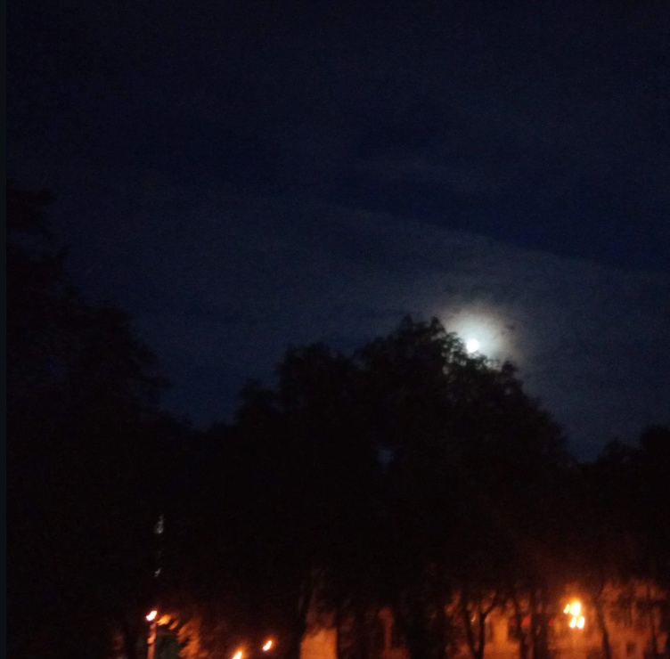

# Persecution

***

<figure><figcaption></figcaption></figure>

The starry night is blooming\
Whilst grooming on the way\
For thinking time it is, to unveil the ceil\
The breeze as the one from the Adriatic\
So refreshing yet miriad-ic\
Here am I, upon the skies\
Here am I, upon the nights\
All of the slumbers and the lullabies\
We have sang along the way\
The camp and mercenary, both taught us some\
The path to uncover, is to glow\
My way of spirit, aiming at the Star\
Solely the one, of the sailings' one\
A one, known for the way\
A one, known for the distance\
Persistence of the trial\
May be surpassed, shall be done\
The mountain must be lifted\
The mountain will be lifted, but why?\
For whay have you gone so far\
Just to unveil the cry?

***
