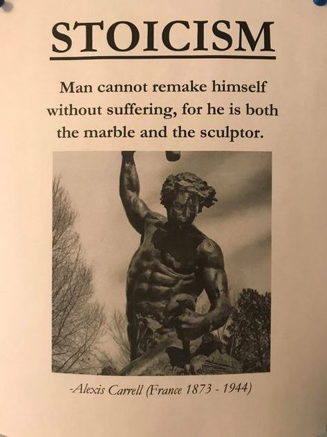

# Атаксія

***

<figure><figcaption></figcaption></figure>

Деколи, при спробах прямування за ціллю\
Ми починаємо падати\
Буває боляче, буває ні\
Але вставати треба, вставати треба

...

десь не так і давно, рахуймо, два дні тому\
мені наснився дуже цікавий  сон, з якого я пам'ятаю уривки\
район - середина Левандівки\* - класичний радянсько-модерновий район Львова; нічого особливого\
Двори, будинки якогось більш  цегляного кольору, що досить дивно\
небеса- якогось більш лавандового кольору; фіолетово-тьмяні\
І дивлюся на право - починається якесь сильне торнадо, що мене паралізує зі страху, хоча я й пробу втекти\
Все ж таки, воно мене наздоганяє, але замість звичайного повороту сюжету, починається щось цікаве\
як на старих екранах телевізорів совітської доби, ось цей ефект "шипіння", коли нема зв'язку, але й він був фіолетовий\
і це все, що я пам'ятаю  з цього сну, дуже дивно було це все осмислювати

...

Вчення без роздумів марне, але й роздуми без навчання небезпечні. - Конфуцій

важко тій людині діяти, яка багато думає, але мало втілює\
на жаль, багато з нас живуть таким чином, що мало втілено\
ми маємо щось робити для нас же самих і майбутнього наших людей\
грамота про грамоту не поможе тим, хто не жадає знань\
думки людини дуже небезпечні: вони можуть бути й ліками, і сильною отрутую. Все залежить від дози й сприйняття\
Одну річ можна сприйняти по-різному\
Це й виділяє людину - атаксія вибору

\*район, знаний своєю контроверсійністю в минулому

***
