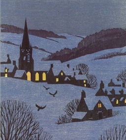

# Церква

***

<figure><figcaption></figcaption></figure>

Нічнії образи минають\
Легко вітер завива\
Люди - зі снів встають\
А крига тане,в'яне\
Праця жде, народ - живе\
І рятунку тут нема - час своє бере\
Циклічність процесу іскреного, живого\
А прийде день - і в храм уже пора\
Тиха з совістю розмова\
Вже й з уст не ісповза\
А думки, супутники нові\
Ведуть у далечінь\
Далечінь, яку пізнати треба\
Далечінь, яку віддати треба\
І нема в нас рятунку\
Бо всім нам прийде час іти\
І як вперше, так востаннє\
Споглянеш ти на собор\
І згадаєш слово скромне, тихе\
"Люби!"

***

