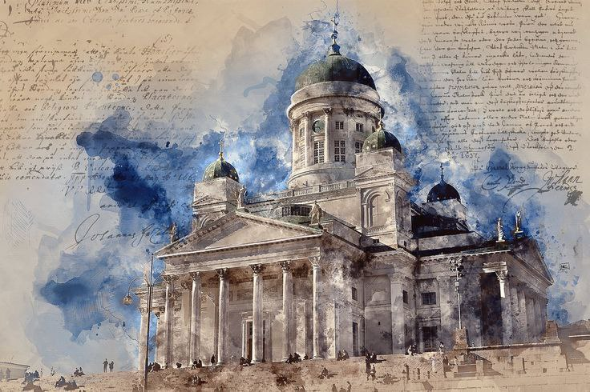

# Гельсінки

***

<figure><figcaption></figcaption></figure>

Холод і туман\
Люмінесцентні барва, як аврори сяйва\
Руки мерзнуть, стопи холонуть\
Лиш чайки співають, понуро й хмуро\
Льодні крижинки яко Антарктика\
Холодна, без людна й навіть страшна\
Морозну я, сподіваючись на теплішую погоду\
На нрав вітра й тепла\
Пронизує думка холодніша від видиху вітру\
"Вдома чи я буду?" - запитаю я

***
