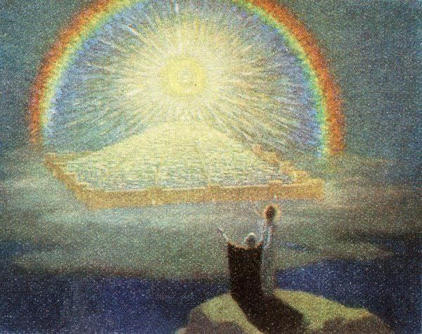

# Голоси

***

<figure><figcaption></figcaption></figure>

часто тоді, коли я прогулююся\
у мене вирують різні думки\
бува - страшні, бува - дурні\
каламбур у катавасіях\
мина й хмара змін - сумна\
часто я бачу\
смутні образи на картині живописця\
на ймення життя\
дурні, страшні образи\
постають і путають - тпру!\
боюсь я глянути в очі цим кораблям\
пливуть, та не знають куди(чи чому?)\
шукаючи себе, боротьба була доконана\
ціною ж себе, себе ізградив\
град я свій виходив\
сумні, моторошні фотографії\
кораблів, які випливти не змогли\
тікати - не комільфо, лякати - боягузтва єство\
лялькар і сам не скаже\
де кінець, а де початок\
сумного голосу голів\
голів, яких я вже не найду\
бо глибше за мене\
вже вони спину гнуть

***
