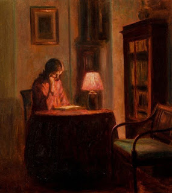

# Ноктюрн

***

<figure><figcaption></figcaption></figure>

Зорі я вже й не бачу\
Лісна феєрія в душі ігра\
Ігра, палає, крякотить\
Покою знать не зна!\
І дим пахкотить наскрізь\
Граючи в дебют-етюд\
Гоголівський чар-ноктюрн!\
О, дивнії бестії\
Казок сих опіваних\
Фольклор живе й 'че!\
У душі свакого од нас!\
А малювать піду я такт\
Вії вія розпущу\
Заснуть вже й не збагну\
Хвойні й пустельні\
Нічні й денні\
Рослини колом постають\
Портрети тих, хто є\
Але знать забуть буде\
Давнії зугераути\
Не зрівняться вмить однак!\
Оком змигнуть есть маст\
Єр ноктюрн уже не тет-а-тет\
Бо небеса ждуть й молять\
Да вернеться сей юнак\
До себе в край\
Пастельних хмар і розмарин\
Ватра й вдова уже!\
Новонароджена вона\
Ноктюрна жде однак\
А світанок вже й виграва\
Сурму нових свічей

***

