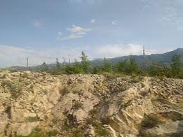

# Ода вітряная

***

<figure><figcaption></figcaption></figure>

І вулиці мчуть\
Як дні, а бува й німії\
Спогляда на день голова\
І зна, що все се збува\
Великії будинки-квартири\
Як тії літи-моноліти\
І нічого не зробиш, тільки час\
Той вмиє всіх і вас\
Нічого й ніхто не має сил\
А час до вас прийде\
І вітром-риссю вмить замете!\
Вітер, о вітер!\
Супутник подорожей і недуг\
Вмий волосся наше своїм бризом\
Вмий лиця й наші серця\
Бо оду співать хтось ма!\
І це будемо ми\
це будемо ми!\
Хирляві й міцні\
Розумні й дурні\
Сплячі й наяві\
Живі й мертві\
Веселі й сумні\
Всі ми - як один\
Будемо дихати й казати\
"Вітер - наша ода до змін"

***

