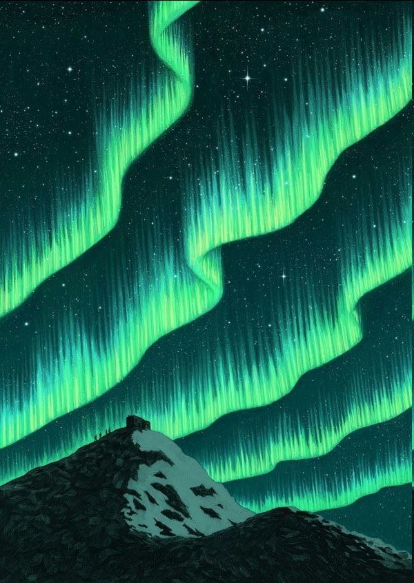

# Патаґонія

***

<figure><figcaption></figcaption></figure>

\
Далечінь цих земель\
Незвіданих, величних\
Що манять величчю й тишшю\
Каждому свій нрав і права\
О, гори, піски й низини\
Пронизливий крик вітру\
Який оглушує вуха жеребця\
Згадуючи запах чебреця\
Фйорди й глацьєри, то душа моя!\
Ґренландія - не моя\
Сніги й тундри - це сибірське\
Кості наших там - одвічні\
Ця ж земля, далекая, шпаньйольська\
І сонце, і місяць\
Однакові вони в тому місці\
Куди не підеш - шляху не знайдеш\
Право, ліво - океани ревуть\
Лише природою будеш жити\
Надією та спокоєм\
Надій зітлілих, милих

***
