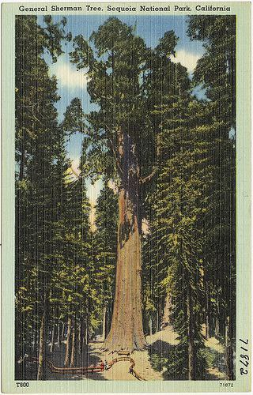

# Секвоя

***

<figure><figcaption></figcaption></figure>

Секвоя\
Древності єси ти знак\
Бачила малих і мертвих\
Вічно зелена, вічно молода\
Задивляючись на крони\
Знайду й себе в родоводі\
Гірляндоб мигтить твоя душа\
Далекая вона ж зоря\
Згадуючи одіссеї\
Пом'янувши вже неживих\
На очі навертаються сльози\
Новостворені курйози\
І біжу, біжу я, як гончак малий\
Не знаючи, куди я й добіжу\
Книжки гортаю, не найду\
О, шукаю я тебе, знання себе\
Не вірю , лжепророків\
Як і не вірив я у людей, що злості наганяють\
Помилки я чинив і виправляв\
Ноги здерті - відновляв\
Замки з картону я направляв, а вітер,поготів, знову їх збивав\
Нові кораблі являлись і зникали\
Маяки мерехтіли в ночі млості\
Привиди минувщини й даності\
Казали, щоб я й обернувся\
Згадуючи твори Гоголя - не обернувся\
Крик Вія я почув - біжу\
Бачу ранок та й мовчу\
Не звідавши цієї мілини, не скажу\
Добре тут чи ні\
Змучений - впаду\
Оком знову огляну\
Стареє дерево, секвою\
Яка мене й одобрить

***
