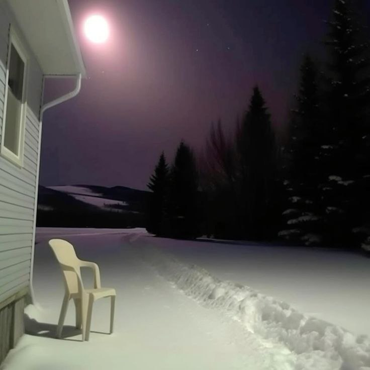

# Снігова балада

***

<figure><figcaption></figcaption></figure>

Ніч - млявості лік\
Очі бояться, ноги тремтять\
Єр вані сніг і мороз летять\
Епіфаній сніжинок - зими імператив\
Зарадити цій мраці студеній\
Либонь і не варто\
Що це - мука чи глава\
Розділу о бування старослов'янської душі\
Блукали, шукали - знайшли\
Імператив зими - сумний, тривожний\
Час тече, зима піде\
Водограй ефімерностей і видінь\
Круговерть людей і спогадів\
Пісні й стогін - не розрізнити\
Нірвана чи Нарва - де я?\
Сумна стежина, Інгрійська могила

***
