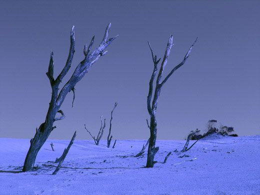

# Теплі історії

***

<figure><figcaption></figcaption></figure>


Деколи, сидячи або лежачи вночі
\
Я думаю,як мені жилося у минулому
\
Бували гарні, а бувалм й ні, спогади
\
Я не дуже люблю судити за тим, що відбулось
\
Хоча й люди не міняються, але не всіх можна під одну лінійку
\
Є ті, хто мене щиро здивували, вони змінились
\
Інші ж пішли шляхом, який не перетинається з моїм, і їх я вже не бачив
\
Бувало, що й я йшов - бо бачив, що попереду в мене не дуже гарні часи, а власне - темна, жорстока ніч

...
\
Знаю, що є ті, які теж таке роблять, як я,
\
І, можливо, я з вами перетнусь
\
Багато людей ще не бачив я, і багато людей ще не бачили мене

...

Вітер не завжди є ласковим, Деколи, він холодом пронизає душу, вибиваючи останні стержні
\
Але, мабуть, нема нічого ріднішого, ніж тремтіння від холоду й страху

Але я не можу тримати зла на тих, хто мене зобідив чи не зрозумів
\
Мені сумно тоді, коли і не розумію інших
\
Бо багатьом нам бракувало й бракує тепла, яке гріє

***
