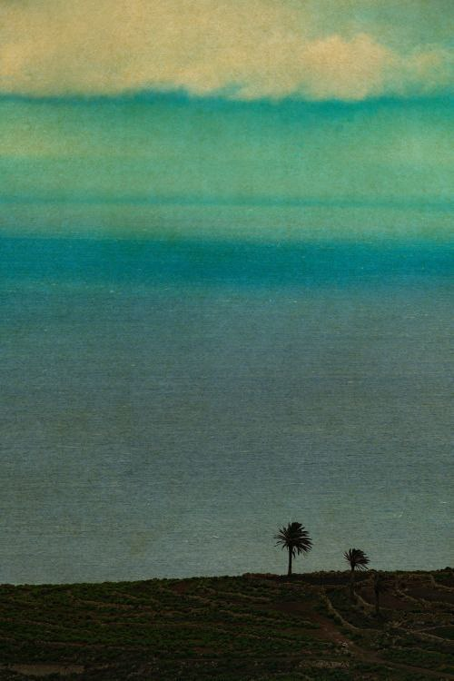

# Загублена душа

***

<figure><figcaption></figcaption></figure>

Загублена душа\
пролог:\
часто ми, люди, шукаючи себе, знаходимо інших гнилі двері, дарма що не свої

Земля вже й не сива - молода\
Кров'ю облита, кістками тримана\
Без болю - без ною\
Атласові плечі - ніщо в порівнянні\
Нема травинки, яка сім'ю не згубила\
Сім'я мілішає - вже нема\
Так і рід згине - не відновиться!\
За старим, злим принципом\
Лишаються ті, хто спритніші,тверді\
Титану міцного сини\
Душі будуть блукати й блукали\
Нема спасіння тим, хто троянди зім'яли\
Ціною не власної крові, а корисливості жагоди\
Вогонь!\
Все згорить, бажано - до тла\
Нова земля постане із стебла\
Забувши, де вона - одна

***
