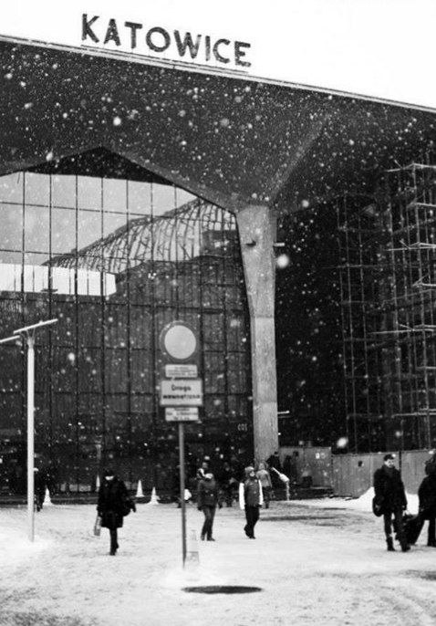

# Catowicka cyganeria

***

<figure><figcaption></figcaption></figure>

Katowicka cyganeria\
O, tancowac i spiewac bedzie ja\
Medzy tramwajow i kafe\
O, zabierz mnie z tad, skad jestem!\
Prosze, blagam, chce spacerowac i malowac\
Probujac pisanie, bedzie malowanie!\
Karykaturka mala, zabawna, piekna\
I tylko o tym bedzie myslalem\
O, cyganerio, duszo moja!\
Zaswze bedzie artystyczny, smialy i nowy!\
a jak ktos lub cos ta zapyta\
to bedzie, zostanie, tam\
daleko\
gdzie spiewam cyganskich i morawijskich piosenek\
u Katowicach Silezijskich!

***
